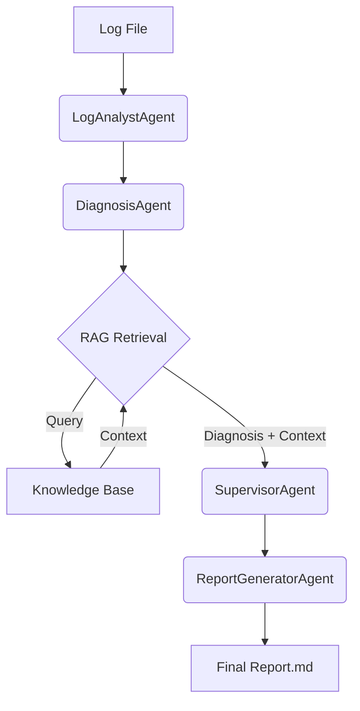

# 🤖 Multi-Agent Log Analyzer


Bienvenido a **Multi-Agent Log Analyzer**, una solución avanzada impulsada por IA para el análisis automatizado de registros de sistemas. Este proyecto utiliza una arquitectura multi-agente y Generación Aumentada por Recuperación (RAG) para diagnosticar errores, correlacionar eventos y generar informes detallados de resolución de problemas.

## 🚀 Características Principales

* **Arquitectura Multi-Agente**: Agentes especializados para análisis, diagnóstico, supervisión y generación de informes.
* **RAG (Retrieval-Augmented Generation)**: Enriquece los diagnósticos con contexto relevante extraído de una base de conocimientos local.
* **Análisis Semántico**: Utiliza modelos de lenguaje grandes (LLMs) para comprender el contexto de los logs, no solo patrones de texto.
* **Salida Estructurada**: Genera informes en formato Markdown listos para ser consumidos por equipos de ingeniería.
* **Extensible**: Fácil de añadir nuevos agentes o documentos a la base de conocimientos.

## 🛠️ Instalación y Configuración

Sigue estos pasos para configurar el entorno de desarrollo:

### 1. Clonar el repositorio

```bash
git clone https://github.com/tu-usuario/multi-agent-log-analyzer.git
cd multi-agent-log-analyzer
```

### 2. Configurar el entorno virtual

Se recomienda usar un entorno virtual para gestionar las dependencias.

```bash
python -m venv .venv
source .venv/bin/activate  # En Windows: .venv\Scripts\activate
```

### 3. Instalar dependencias

```bash
pip install -r requirements.txt
```

### 4. Configurar variables de entorno

Crea un archivo `.env` en la raíz del proyecto y añade tu clave de API de OpenAI:

```env
OPENAI_API_KEY="sk-tu-clave-api-aqui"
MODEL_NAME="gpt-4o-mini"  # Opcional: especifica el modelo LLM a usar, en su defecto es gpt-4o-mini
```

## 💻 Uso

Para analizar un archivo de log, ejecuta el script principal proporcionando la ruta al archivo:

```bash
python main.py data/sample_logs.txt
```

El sistema procesará los logs y generará un informe en:
`outputs/report.md`

### Ejemplo de Flujo

1. **LogAnalystAgent**: Lee el archivo `sample_logs.txt` e identifica los errores.
2. **DiagnosisAgent**: Determina las posibles causas raíz de los errores detectados.
3. **RAGContextRetriever**: Busca en `knowledge_base/documents/` soluciones conocidas para problemas similares (ej. `db_timeout.txt`). Esta información se utiliza en los siguientes pasos para mejorar la calidad de los resultados.
4. **SupervisorAgent**: Decide si se debe generar el reporte basandose en la confianza del diagnóstico.
5. **ReportGeneratorAgent**: Compila toda la información en un informe final legible.

## 📂 Estructura del Proyecto

A continuación se detalla la organización del código fuente:

<details>
<summary><strong>Ver estructura de directorios</strong></summary>

| Ruta | Descripción |
| :--- | :--- |
| `main.py` | Punto de entrada principal de la aplicación CLI. |
| `orchestrator/` | Contiene la lógica de orquestación del pipeline. |
| `agents/` | Directorio con la implementación de los agentes de IA. |
| ├── `log_analyst/` | Agente encargado del análisis inicial de logs. |
| ├── `diagnosis/` | Agente que identifica causas raíz. |
| ├── `supervisor/` | Agente que valida y supervisa el proceso. |
| └── `report_generator/` | Agente que redacta el informe final. |
| `rag/` | Módulo para la recuperación de información (RAG) usando FAISS. |
| `knowledge_base/` | Documentos de texto utilizados como contexto para el RAG. |
| `prompts/` | Plantillas de texto (prompts) para los agentes LLM. |
| `data/` | Archivos de logs de ejemplo para pruebas. |
| `outputs/` | Directorio de salida para los informes generados. |
| `utils/` | Utilidades comunes como logging y manejo de excepciones. |

</details>

## 🧠 Arquitectura del Sistema

El sistema funciona como un pipeline secuencial donde la salida de un agente se convierte en la entrada del siguiente, enriquecido con información externa cuando es necesario.



## 🤝 Contribución

¡Las contribuciones son bienvenidas! Por favor, sigue estos pasos:

1. Haz un Fork del proyecto.
2. Crea una rama para tu funcionalidad (`git checkout -b feature/nueva-funcionalidad`).
3. Realiza tus cambios y haz commit (`git commit -m 'Añadir nueva funcionalidad'`).
4. Haz push a la rama (`git push origin feature/nueva-funcionalidad`).
5. Abre un Pull Request.

## 📄 Licencia

Este proyecto está bajo la Licencia MIT.\
Es un proyecto principalmente educativo y de investigación.
